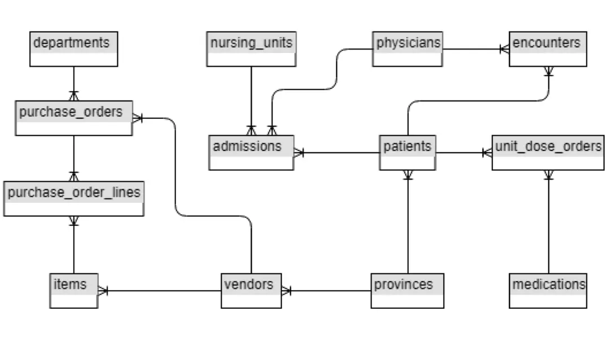
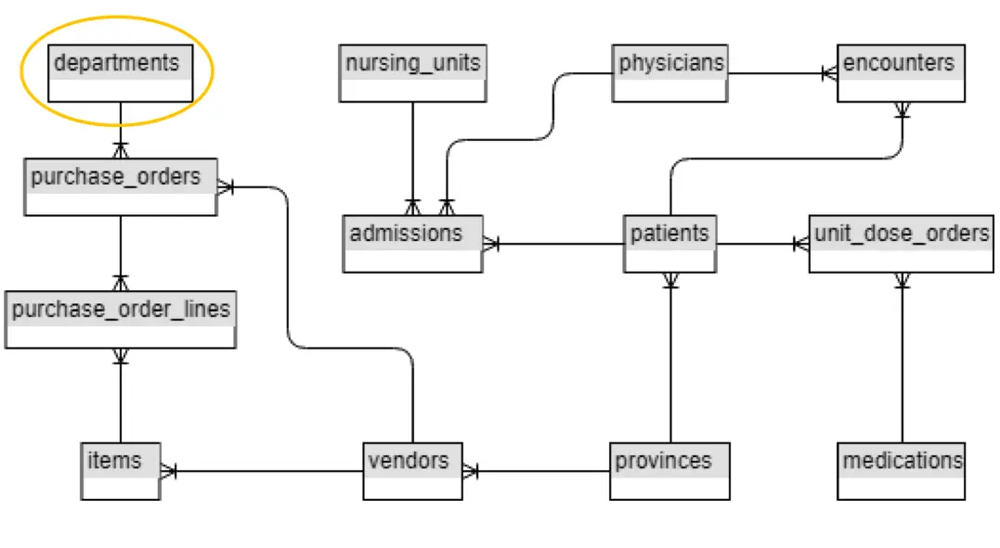

# Introduction

## Tools

- [SQL Server 2017 Express Database](https://www.microsoft.com/en-ca/download/details.aspx?id=55994)
  - The actual database runs as a service
- [SQL Server Management Studio (SSMS)](https://docs.microsoft.com/en-us/sql/ssms/download-sql-server-management-studio-ssms?view=sql-server-ver15)
  - The application we will use to access the database
  - Both, freely available from Microsoft

## Windows Services

- SSMS is not the database itself, it is an application (with UI) that is used
  to interact with the database
- The database itself runs as a Windows service
- A Windows service is a long-running program that doesn’t require user
  intervention; it has no UI
- Databases (and other OS components) run as services
- Run Task Manager (Ctrl+Shift+Esc), click More details if necessary, click
  Services tab to see all services

## What is a Database?

- A shared collection of logically related data, designed to meet the
  information needs of multiple users

## Database Terminology (_Smallest Component to Largest_)

- **Character**
  - Various alphanumeric characters, digital, and special characters
  - Examples: D b 4 7 * ;
- **Column**
  - Sometimes referred to as a field
  - The vertical columns of a database
  - Contains actual value consisting of one or more characters
  - Each column contains the same type of information for every record in table
  - Common columns relate data in multiple tables i.e. relation

- **Row**
  - Sometimes referred to as a record
  - The horizontal rows of a database
  - Each row contains one or more columns
  - Each row in table contains same columns

- **Table**
  - Collection of related rows
  - Tables can be linked together to view (or manipulate) data as if one table
- **Entity**
  - A person, place or thing
  - Represented by a table
- **Attribute**
  - A descriptor of an entity
  - Represented by column headings

| department_id | department_name            | manager_first_name | manager_last_name |
| ------------- | -------------------------- | ------------------ | ----------------- |
| 1             | Nursing Administration     | Awhina             | Broughton         |
| 2             | Housekeeping               | Ellen              | Crozier           |
| 3             | Maintenance                | Hillary            | Bauer             |
| 4             | Accounting and Finance     | Judy               | Brownlee          |
| 5             | Supply, Processing & Dist. | Alison             | Rayner            |
| 6             | Radiology                  | Bryan              | Nolan             |
| 7             | Laboratory                 | Linda              | Cooper            |
| 8             | Occupational Therapy       | Audrey             | March             |
| 9             | Nuclear Medicine           | Jesse              | Brewer            |
| 10            | Food Services              | Gary               | Fraser            |

- **Database**
  - Collection of related tables and other objects (views, triggers, procedures)

   

## Database Uses

- Retailing companies
  - Inventory data
- Manufacturing companies
  - Product data
- Banks
  - Account data
- Hospitals
  - Patient data
- Schools, Colleges and Universities
  - Student data

## What is a Data Dictionary?

- It is the repository of all data definitions for all objects within the scope
  of the database
- It contains meta-data (data about the data)
- Meta data examples:
  - Table name, column name, data constraints, primary and foreign keys, index

## Structured Query Language (SQL)

- History
- It started life as SEQUEL in 1974, an IBM product
- In 1980 it was renamed SQL
- There is a SQL standard maintained by the American National Standards
  Institute (ANSI)
- Most database vendors extend the standard
- It is the access language used by many Database Management System (DBMS)
  products, including Oracle, MySQL, Microsoft SQL Server, PostgreSQL, IBM DB2,
  Microsoft Access, SQLite and many more
- SQL is not a programming language
- Includes Data Definition Language (DDL) and Data Manipulation Language (DML)

## SQL Statements

- Data Definition Language (DDL)
  - CREATE table
  - CREATE index
- Data Manipulation Language (DML)
  - SELECT
  - INSERT
  - UPDATE
  - DELETE

## SQL Characteristics

- SQL is not case sensitive
- Depending on the database vendor, data can be case sensitive
  - 'M' <> 'm'
- Character data must be inside single quotes

## Basic SELECT Statement

```sql
SELECT * (represents all columns)
FROM table_name
```

- Example:

```sql
select *
from patients
```

- SQL ignores white space
- Example:

```sql
select       *

               from

    patients
```

- Convention is to capitalize keywords and place each clause on its own line
- Example:

```sql
SELECT *
FROM patients

SELECT list_of_column_names, separated_by_comma
FROM table_name
```

Example:

```sql
SELECT patient_id, last_name
FROM patients
```

## SELECT Statement

- Keywords SELECT and FROM are required in most implementations, FROM is
  optional in SQL Server

```sql
SELECT nursing_unit_id
FROM admissions
```

## DISTINCT Clause

- Duplicates can be removed using DISTINCT qualifier

```sql
SELECT DISTINCT nursing_unit_id
FROM admissions
```

## Sorting Data

- Use ORDER BY
- Can be one or more columns in list
- Can be in ascending or descending order

```sql
SELECT list_of_column_names
FROM table_name
ORDER BY list_of_column_names
```

## ORDER BY Examples

```sql
SELECT *
FROM patients
ORDER BY last_name

SELECT *
FROM patients
ORDER BY city ASC, birth_date DESC
```

## Retrieving a Subset of Data

- **Syntax**:

```sql
SELECT list_of_column_names
FROM table_name
WHERE list_of_conditions
```

- **Example**:

```sql
SELECT *
FROM admissions
WHERE room = 5
```

- Use `WHERE`
- `WHERE` clause can hold multiple conditions using `AND` and `OR` logic
- Examples:

```sql
SELECT *
FROM admissions
WHERE room = 5 AND nursing_unit_id = 'CCU'

SELECT *
FROM patients
WHERE province_id = 'NL' OR province_id = 'QC'
```

## Order of Clauses in SELECT

```sql
SELECT list_of_columns
FROM list_of_tables
WHERE list of conditions
ORDER BY expressions
```

## Expressions

- An expression can be
  - A column name
  - Text
    - 'this is a text string'
    - 10
    - last_name + ', ' + first_name
  - A function
    - LEN('Blake')
    - SQRT(144) + 5
    - STR(SQRT(99), 5, 3)
    - GETDATE()

## Conditions

- Purpose:
  - To specify a combination of one or more expressions and logical operators
    that evaluates to either TRUE, FALSE or unknown
- Comparison operators
  - =, !=, >, <, >=, <=, [NOT] IN, [NOT] BETWEEN x AND y, [NOT] LIKE, EXISTS, IS
    [NOT] NULL
- Example:

```sql
SELECT *
FROM departments
WHERE department_id IN (1, 5)

SELECT *
FROM departments
WHERE department_id NOT IN (1, 5)

SELECT *
FROM patients
WHERE last_name LIKE 'cr%'

SELECT *
FROM admissions
WHERE room BETWEEN 2 AND 4
```

## LIKE Examples

- `_` matches a single character
- `%` matches any number of characters

```sql
SELECT *
FROM patients
WHERE last_name LIKE 'sm_th'

SELECT *
FROM patients
WHERE last_name LIKE 'sm_th%'

SELECT *
FROM patients
WHERE last_name LIKE '%sm_th%'

SELECT *
FROM patients
WHERE last_name LIKE '%smith%'
```

## Built-in Functions

- Scalar Functions – Single value
  - Number
  - Character
  - Date
- Column Functions
  - Works against set of values

## Mathematical Functions

|         |       |         |
| ------- | ----- | ------- |
| ABS     | ACOS  | ASIN    |
| ATAN    | ATN2  | CEILING |
| COS     | COT   | DEGREES |
| EXP     | FLOOR | LOG     |
| LOG10   | PI    | POWER   |
| RADIANS | RAND  | ROUND   |
| SIGN    | SIN   | SQRT    |
| SQUARE  | TAN   |         |

## String Functions

|            |           |           |
| ---------- | --------- | --------- |
| ASCII      | CHAR      | CHARINDEX |
| DIFFERENCE | LEFT      | LEN       |
| LOWER      | LTRIM     | NCHAR     |
| PATINDEX   | QUOTENAME | REPLACE   |
| REPLICATE  | REVERSE   | RTRIM     |
| SOUNDEX    | SPACE     | STR       |
| STUFF      | SUBSTRING | UNICODE   |
| UPPER      |           |           |

## Date And Time Functions

|                   |                  |
| ----------------- | ---------------- |
| CURRENT_TIMESTAMP | DATEADD          |
| DATEDIFF          | DATENAME         |
| DATEPART          | DAY              |
| GETDATE           | GETUTCDATE       |
| ISDATE            | MONTH            |
| SWITCHOFFSET      | TODATETIMEOFFSET |
| YEAR              |                  |

## Column Functions

| Func  | Description                              |
| ----- | ---------------------------------------- |
| AVG   | Computes the average value of the column |
| COUNT | Counts the number of rows                |
| MAX   | Determines the maximum value             |
| MIN   | Determines the minimum value             |
| SUM   | Totals the numeric values                |

```sql
-- Ex: 1
SELECT COUNT(*)
FROM patients

-- Ex: 2
SELECT AVG(patient_weight)
FROM patients

-- Ex: 3
SELECT MIN(last_name)
FROM patients
```
