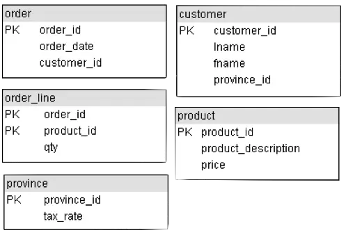
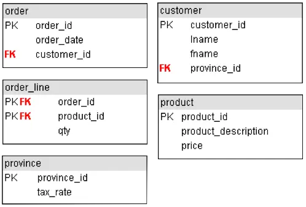
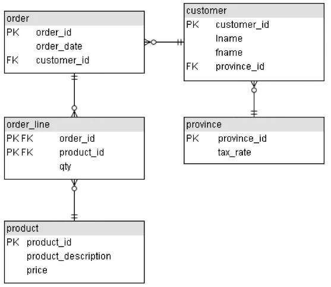
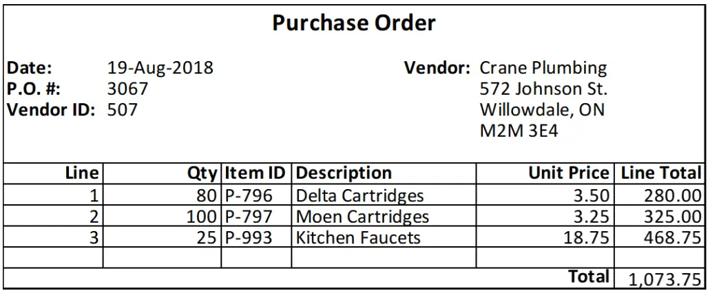
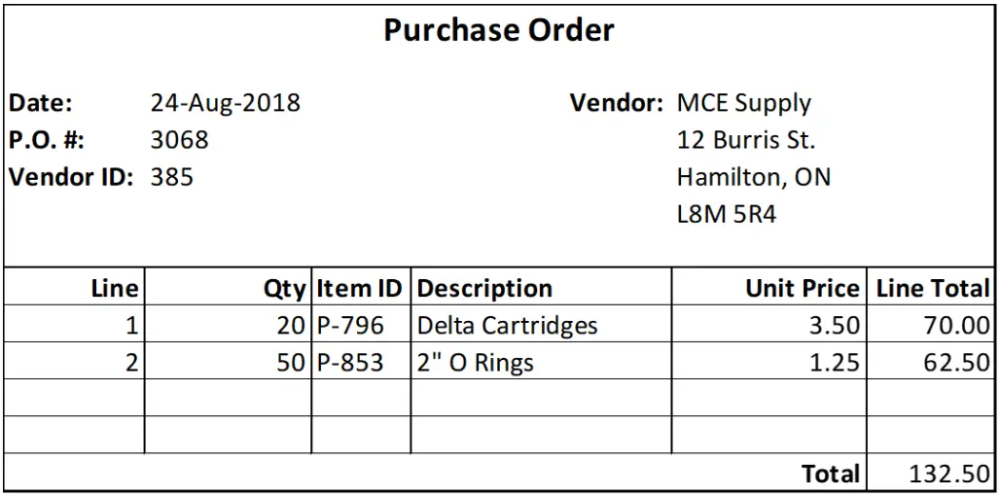
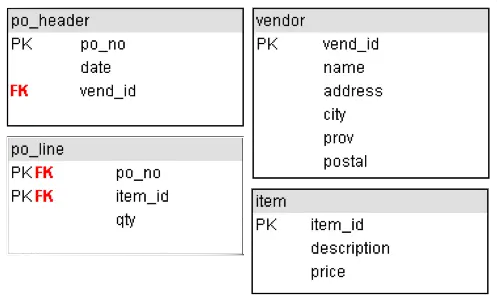
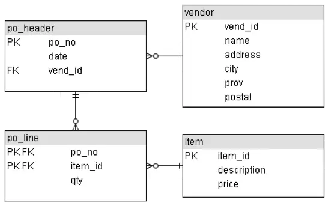

# Normalization - Part 1

## Relational Concepts For The Design Process

- We use the normalization process to group data elements into tables that
  represent entities

## Introduction

- We want to develop a conceptual model that represents the entities of the
  enterprise and the relationships between them
- This model is independent of any DBMS package, hardware or the physical model
- Later on, it will be mapped to an internal model that complies with the chosen
  DBMS
- Normalization is the process of organizing data to minimize redundancy
- Normalized data does’t have storage anomalies
- The organizing of data is done by applying a series of rules to a data model
- While normalization makes databases more efficient to maintain, they can also
  make them more complex because data is separated into many different tables
- This will require most queries to use table joins

## Normal Forms

- **0 Normal Form** (0NF): un-normalized model before the normalization rules
  have been applied
- **First Normal Form** (1NF)
- **Second Normal Form** (2NF)
- **Third Normal Form** (3NF)
- Boyce Codd Normal Form (BCNF)
- Fourth Normal Form (4NF)
- Fifth Normal Form (5NF)
- Domain Key Normal Form (DKNF)
- Each previous level must be applied before proceeding to the next

## First Normal Form (1NF)

- Reduce entities to first normal form (1NF) by removing repeating or
  multi-valued attributes to another, child entity
- To simplify, you cannot have multiple fields to capture multiple values
- Most common ‘sins’ against the first normal form are the lack of a primary key
  and the use of repeating columns
- Also, remove calculated fields

## 0NF (un-normalized)

- No rules have been applied to this model
- Note the repeating product columns
- This does not allow for more products to be added and creates cells with null
  values
- Also note the calculated fields: `ExtPrice1 = Qty1 * Price1`,
  `Amount = ExtPrice1 + ExtPrice2 + ExtPrice3`

| Order | OrderDate  | CustId | LName  | FName | Prov | TaxRate | Prod | ProdDesc      | Qty1 | Price | ExtPrice1 | Prod2 | ProdDesc2   | Qty2 | Price2 | ExtPrice2 | Prod3 | ProdDesc   | Qty3 | Price3 | ExtPrice3 | Amount |
| ----- | ---------- | ------ | ------ | ----- | ---- | ------- | ---- | ------------- | ---- | ----- | -------- | ----- | ----------- | ---- | ------ | -------- | ----- | ---------- | ---- | ------ | -------- | ------ |
| 239   | 2017-01-08 | 1135   | Black  | John  | ON   | 0.08    | 555  | Cheese Tray   | 10   | 10.00 | 100.00   | 444   | Wine Gift   | 15   | 20.00  | 300.00   |       |            |      |        |          | 400.00 |
| 240   | 2017-01-10 | 1135   | Black  | John  | ON   | 0.08    | 343  | Bottle Opener | 15   | 2.00  | 30.00    | 555   | Cheese Tray | 20   | 10.00  | 200.00   | 111   | Wine Glass | 25   | 4.00   | 100.00   | 330.00 |
| 241   | 2017-01-11 | 1140   | Brown  | Jack  | ON   | 0.08    | 231  | Hat           | 5    | 7.50  | 37.50    | 123   | Bat         | 2    | 25.00  | 50.00    |       |            |      |        |          | 87.50  |
| 243   | 2017-01-15 | 1140   | Brown  | Jack  | ON   | 0.08    | 321  | Cards         | 25   | 3.00  | 75.00    |       |             |      |        |          |       |            |      |        |          | 75.00  |
| 245   | 2017-01-16 | 1152   | Mills  | Mike  | BC   | 0.07    | 451  | Shoes         | 4    | 30.00 | 120.00   | 321   | Cards       | 15   | 3.00   | 45.00    |       |            |      |        |          | 165.00 |
| 246   | 2017-01-20 | 1156   | Levey  | Kyle  | MB   | 0.07    | 555  | Cheese Tray   | 5    | 10.00 | 50.00    | 231   | Hat         | 10   | 7.50   | 75.00    | 321   | Cards      | 20   | 3.00   | 60.00    | 185.00 |
| 255   | 2017-01-22 | 1174   | Little | Tony  | SK   | 0.05    | 444  | Wine Gift     | 8    | 20.00 | 160.00   | 12    | Soccer Ball | 12   | 10.00  | 120.00   |       |            |      |        |          | 280.00 |
| 256   | 2017-01-25 | 1174   | Little | Tony  | SK   | 0.05    | 945  | Chair         | 2    | 50.00 | 100.00   | 932   | Table       | 1    | 100.00 | 100.00   | 910   | Couch      | 1    | 300.00 | 300.00   | 500.00 |
| 260   | 2017-01-26 | 1180   | Nye    | Bill  | PE   | 0.10    | 800  | Glasses       | 100  | 2.50  | 250.00   |       |             |      |        |          |       |            |      |        |          | 250.00 |

## 1NF

- Two tables have been created: `Order` and `Product`
- They are linked by the `Order` field
- This eliminates the repeating fields in a record
- Calculated values `ExtPrice1`, `ExtPrice2`, `ExtPrice3` and `Amount` have been
  discarded

| Order | OrderDate  | Custld | LName  | FName | Prov | TaxRate |
| ----- | ---------- | ------ | ------ | ----- | ---- | ------- |
| 239   | 2017-01-08 | 1135   | Black  | John  | ON   | 0.08    |
| 240   | 2017-01-10 | 1135   | Black  | John  | ON   | 0.08    |
| 241   | 2017-01-11 | 1140   | Brown  | Jack  | ON   | 0.08    |
| 243   | 2017-01-15 | 1140   | Brown  | Jack  | ON   | 0.08    |
| 245   | 2017-01-16 | 1152   | Mills  | Mike  | BC   | 0.07    |
| 246   | 2017-01-20 | 1156   | Levey  | Kyle  | MB   | 0.07    |
| 255   | 2017-01-22 | 1174   | Little | Tony  | SK   | 0.05    |
| 256   | 2017-01-25 | 1174   | Little | Tony  | SK   | 0.05    |
| 260   | 2017-01-26 | 1180   | Nye    | Bill  | PE   | 0.10    |

| Order | Prod | ProdDesc      | Qty | Price  |
| ----- | ---- | ------------- | --- | ------ |
| 239   | 555  | Cheese Tray   | 10  | 10.00  |
| 239   | 444  | Wine Gift     | 15  | 20.00  |
| 240   | 343  | Bottle Opener | 15  | 2.00   |
| 240   | 555  | Cheese Tray   | 20  | 10.00  |
| 240   | 111  | Wine Glass    | 25  | 4.00   |
| 241   | 231  | Hat           | 5   | 7.50   |
| 241   | 123  | Bat           | 2   | 25.00  |
| 243   | 321  | Cards         | 25  | 3.00   |
| 245   | 451  | Shoes         | 4   | 30.00  |
| 245   | 321  | Cards         | 15  | 3.00   |
| 246   | 555  | Cheese Tray   | 5   | 10.00  |
| 246   | 231  | Hat           | 10  | 7.50   |
| 246   | 321  | Cards 20      | 3.  | 00 255 |
| 444   | Wine | Gift          | 8   | 20.00  |
| 255   | 12   | Soccer Ball   | 12  | 10.00  |
| 256   | 945  | Chair         | 2   | 50.00  |
| 256   | 932  | Table         | 1   | 100.00 |
| 256   | 910  | Couch         | 1   | 300.00 |
| 260   | 800  | Glasses       | 100 | 2.50   |

## Second Normal Form (2NF)

- Reduce first normal form entities to second normal form (2NF) by removing
  attributes that are not dependent on the whole primary key
- The primary key for each record must be able to determine the value for all of
  the other fields in the records

## 1NF

- Here knowledge of the `Product#` alone provides the product description and
  price without the `Order#`
- We must create another table for this to conform to 2NF

| Order | Prod | ProdDesc      | Qty | Price  |
| ----- | ---- | ------------- | --- | ------ |
| 239   | 555  | Cheese Tray   | 10  | 10.00  |
| 239   | 444  | Wine Gift     | 15  | 20.00  |
| 240   | 343  | Bottle Opener | 15  | 2.00   |
| 240   | 555  | Cheese Tray   | 20  | 10.00  |
| 240   | 111  | Wine Glass    | 25  | 4.00   |
| 241   | 231  | Hat           | 5   | 7.50   |
| 241   | 123  | Bat           | 2   | 25.00  |
| 243   | 321  | Cards         | 25  | 3.00   |
| 245   | 451  | Shoes         | 4   | 30.00  |
| 245   | 321  | Cards         | 15  | 3.00   |
| 246   | 555  | Cheese Tray   | 5   | 10.00  |
| 246   | 231  | Hat           | 10  | 7.50   |
| 246   | 321  | Cards 20      | 3.  | 00 255 |
| 444   | Wine | Gift          | 8   | 20.00  |
| 255   | 12   | Soccer Ball   | 12  | 10.00  |
| 256   | 945  | Chair         | 2   | 50.00  |
| 256   | 932  | Table         | 1   | 100.00 |
| 256   | 910  | Couch         | 1   | 300.00 |
| 260   | 800  | Glasses       | 100 | 2.50   |

## 2NF

- Another table has been created: `OrderLine`
- It is linked to the product table with the common field product
- Therefore each product description is entered once in the database rather than
  each time someone purchases the item
- The combination of `Order#` and `Product#` are needed to identify quantity

| Order | Prod | Qty |
| ----- | ---- | --- |
| 239   | 555  | 10  |
| 239   | 444  | 15  |
| 240   | 343  | 15  |
| 240   | 555  | 20  |
| 240   | 111  | 25  |
| 241   | 231  | 5   |
| 241   | 123  | 2   |
| 243   | 321  | 25  |
| 245   | 451  | 4   |
| 245   | 321  | 15  |
| 246   | 555  | 5   |
| 246   | 231  | 10  |
| 246   | 321  | 20  |
| 255   | 444  | 8   |
| 255   | 12   | 12  |
| 256   | 945  | 2   |
| 256   | 932  | 1   |
| 256   | 910  | 1   |
| 260   | 800  | 100 |

| Prod | ProdDesc      | Price  |
| ---- | ------------- | ------ |
| 12   | Soccer Ball   | 10.00  |
| 111  | Wine Glass    | 4.00   |
| 123  | Bat           | 25.00  |
| 231  | Hat           | 7.50   |
| 321  | Cards         | 3.00   |
| 343  | Bottle Opener | 2.00   |
| 444  | Wine Gift     | 20.00  |
| 451  | Shoes         | 30.00  |
| 555  | Cheese Tray   | 10.00  |
| 800  | Glasses       | 2.50   |
| 910  | Couch         | 300.00 |
| 932  | Table         | 100.00 |
| 945  | Chair         | 50.00  |

## Getting Smaller

- The order table that started with 23 fields has now shrunk considerably
- 3NF will reduce this further by removing the redundant names, provinces and
  tax rates

| Order | OrderDate  | Custld | LName  | FName | Prov | TaxRate |
| ----- | ---------- | ------ | ------ | ----- | ---- | ------- |
| 239   | 2017-01-08 | 1135   | Black  | John  | ON   | 0.08    |
| 240   | 2017-01-10 | 1135   | Black  | John  | ON   | 0.08    |
| 241   | 2017-01-11 | 1140   | Brown  | Jack  | ON   | 0.08    |
| 243   | 2017-01-15 | 1140   | Brown  | Jack  | ON   | 0.08    |
| 245   | 2017-01-16 | 1152   | Mills  | Mike  | BC   | 0.07    |
| 246   | 2017-01-20 | 1156   | Levey  | Kyle  | MB   | 0.07    |
| 255   | 2017-01-22 | 1174   | Little | Tony  | SK   | 0.05    |
| 256   | 2017-01-25 | 1174   | Little | Tony  | SK   | 0.05    |
| 260   | 2017-01-26 | 1180   | Nye    | Bill  | PE   | 0.10    |

## Third Normal Form (3NF)

- Third normal form is violated when a non-key field is a fact about another
  non-key field
- Reduce second normal form entities to third normal form (3NF) by removing
  attributes that are dependent on other attributes

## 3NF

- By creating another two tables our order table is down to 3 fields
- We've eliminated the name fields by linking the `CustID` to a separate `Customer`
  table, and likewise for the tax rate using the province abbreviation

| Order | OrderDate  | Custld |
| ----- | ---------- | ------ |
| 239   | 2017-01-08 | 1135   |
| 240   | 2017-01-10 | 1135   |
| 241   | 2017-01-11 | 1140   |
| 243   | 2017-01-15 | 1140   |
| 245   | 2017-01-16 | 1152   |
| 246   | 2017-01-20 | 1156   |
| 255   | 2017-01-22 | 1174   |
| 256   | 2017-01-25 | 1174   |
| 260   | 2017-01-26 | 1180   |

- This removes the redundancy of the customer name and province each time an
  order is placed

| Custld | LName       | FName | Prov |
| ------ | ----------- | ----- | ---- |
| 1135   | Black John  | ON    |      |
| 1140   | Brown Jack  | ON    |      |
| 1152   | Mills Mike  | BC    |      |
| 1156   | Levey Kyle  | MB    |      |
| 1174   | Little Tony | SK    |      |
| 1180   | Nye Bill    | PE    |      |

- Here the redundancy of the tax rate is removed by creating a table with
  province tax information

| Prov | TaxRate |
| ---- | ------- |
| BC   | 0.07    |
| MB   | 0.07    |
| ON   | 0.08    |
| PE   | 0.10    |
| SK   | 0.05    |

## Order Normalization

- The original un-normalized Order table became 5 normalized tables
  - Customer
  - Order
  - OrderLine
  - Prod
  - Prov

## Third Normal Form Tables

| customer_id | lname | fname | province_id |
| ----------- | ----- | ----- | ----------- |

| order_id | order_date | customer_id |
| -------- | ---------- | ----------- |

| order_id | product_id | qty |
| -------- | ---------- | --- |

| product_id | product_description | price |
| ---------- | ------------------- | ----- |

| province_id | tax_rate |
| ----------- | -------- |

## Creating the ERD

- Draw the entities with their primary keys

- Examine each primary key to see if it appears in another table, if so it is a
  foreign key in the other table

- Each foreign key means there is a relationship between the two tables
- The primary key is on the **one** side and the foreign key is on the **many**
  side

## Normalization Good News/Bad News

- The bad news is that this increases processing complexity
  - In order to get any useful information out of the database, most queries
    will need to join 2 or more tables
- The good news is that the data is organized and unique
  - Each fact is only stored in one place

## Normalization Quick Summary

- **1NF** - Eliminate Repeating Groups And Derived Attributes
  - Make a separate table for each set of related attributes, and give each
    table a primary key
- **2NF** - Eliminate Redundant Data
  - If an attribute depends on only part of a composite key, remove it to a
    separate table
- **3NF** - Eliminate Columns Not Dependent On Key
  - If attributes do not contribute to a description of the key, remove them to
    a separate table

## More Examples

- http://www.bkent.net/Doc/simple5.htm
- http://www.troubleshooters.com/littstip/ltnorm.html
- http://www.databasejournal.com/sqletc/article.php/1428511
- http://databases.about.com/library/weekly/aa080501a.htm
- http://phlonx.com/resources/nf3

## Normalization Case Study

- Pipes N Things Inc.
  - A distributor of plumbing parts and fixtures
  - Purchase from manufacturers
  - Supply retailers
  - Designing corporate data base

## Purchasing Department

- Determine vital entities
- Purchase Order document is critical

## List The Entities Found

- Hint, look for keys
- Keys will usually identify entities

## A Second Purchase Order

## Convert The Purchase Order Documents Into A Two Dimensional Table

| PO_No | Date       | Vend_ID | Name           | Address         | City       | Prov | Postal  | Qty | Item_ID | Description      | Price | Line_Total | Total   |
| ----- | ---------- | ------- | -------------- | --------------- | ---------- | ---- | ------- | --- | ------- | ---------------- | ----- | ---------- | ------- |
| 3067  | 2018-08-19 | 507     | Crane Plumbing | 572 Johnson St. | Willowdale | ON   | M2M 3Е4 | 80  | P-796   | Delta Cartridges | 3.50  | 280.00     | 1073.75 |
|       |            |         |                |                 |            |      |         | 100 | P-797   | Moen Cartridges  | 3.25  | 325.00     |         |
|       |            |         |                |                 |            |      |         | 25  | P-993   | Kitchen Faucets  | 18.75 | 468.75     |         |
| 3068  | 2018-08-24 | 385     | MCE Supply     | 12 Burris St.   | Hamilton   | ON   | L8M 5R4 | 20  | P.796   | Delta Cartridges | 3.50  | 70.00      | 132.50  |
|       |            |         |                |                 |            |      |         | 50  | P-853   | 2" O Rings       | 1.25  | 62.50      |         |

- Results in an un-normalized table
- Multiple occurrences of data exist
- We can find cells that have more than one value:

| Item_ID | Desc | Qty | Description | Price | Line_Total |
| ------- | ---- | --- | ----------- | ----- | ---------- |

## Normalization – The First Step

- Transforming an un-normalized table into one that is in First Normal Form
- 1NF has no repeated occurrences of data items in any of its cells
- Go back to the table and put it into 1NF by repeating some of the data values
  and removing calculated values
- Repeating Values For Attributes

| PO_No | Date | Vend_ID | Name | Address | City | Prov | Postal |
| ----- | ---- | ------- | ---- | ------- | ---- | ---- | ------ |

- Calculated values (`Line_Total`, `Total`) removed

| PO_No | Date       | Vend_ID | Name           | Address         | City       | Prov | Postal  | Qty | Item_ID | Description      | Price |
| ----- | ---------- | ------- | -------------- | --------------- | ---------- | ---- | ------- | --- | ------- | ---------------- | ----- |
| 3067  | 2018-08-19 | 507     | Crane Plumbing | 572 Johnson St. | Willowdale | ON   | M2M 3E4 | 80  | P_796   | Delta Cartridges | 3.50  |
| 3067  | 2018-08-19 | 507     | Crane Plumbing | 572 Johnson St. | Willowdale | ON   | M2M 3E4 | 100 | P-797   | Moen Cartridges  | 3.25  |
| 3067  | 2018-08-19 | 507     | Crane Plumbing | 572 Johnson St. | Willowdale | ON   | M2M 3E4 | 25  | P-993   | Kitchen Faucets  | 18.75 |
| 3068  | 2018-08-24 | 385     | MCE Supply 12  | Burris St.      | Hamilton   | ON   | L8M 5R4 | 20  | P-796   | Delta Cartridges | 3.50  |
| 3068  | 2018-08-24 | 385     | MCE Supply 12  | Burris St.      | Hamilton   | ON   | L8M 5R4 | 50  | P-853   | 2" O Rings       | 1.25  |

- What is the table’s key?
- `…PO_No + Item_ID`

## Normalization – The Second Step

- Isolating
  - What data items are dependent on parts of the key
  - What data items are left dependent on the whole key
- Dependent on PO_No
  - Date
  - Vend_ID
  - Name
  - Address, City, Prov, Postal
- The resulting table with PO_No as the key

| po_no | date | vend_id | name | address | city | prov | postal |
| ----- | ---- | ------- | ---- | ------- | ---- | ---- | ------ |

- Dependent on Item_ID
  - Description
  - Price
- The resulting table with Item_ID as the key

| item_id | description | price |
| ------- | ----------- | ----- |

- The attribute(s) remaining as dependent on the original key is/are
  - Qty
- The third table

| po_no | item_id | qty |
| ----- | ------- | --- |

## Normalization – The Third Step

- Separating any entity that deserves its own relation in the database
- Name each entity
- Look for a key field that has a dependent attribute; a key for another entity
- Is this occurring in our 2NF tables?
- If so, where?

## Third Normal Form Tables

### po_header

| po_no | date | vend_id |
| ----- | ---- | ------- |

### vendor

| vend_id | name | address | city | prov | postal |
| ------- | ---- | ------- | ---- | ---- | ------ |

### item

| item_id | description | price |
| ------- | ----------- | ----- |

### po_line

| po_no | item_id | qty |
| ----- | ------- | --- |

## Creating the ERD

- Draw the entities with their primary keys

- Examine each primary key to see if it appears in another table, if so it is a
  foreign key in the other table

- Each foreign key means there is a relationship between the two tables
- The primary key is on the **one** side and the foreign key is on the **many**
  side

## Storage Anomalies of the First Normal Form

- Insertion Anomaly
- Update Anomaly
- Deletion Anomaly

## For reference

| PO_No | Date       | Vend_ID | Name           | Address         | City       | Prov | Postal  | Qty | Item_ID | Description      | Price |
| ----- | ---------- | ------- | -------------- | --------------- | ---------- | ---- | ------- | --- | ------- | ---------------- | ----- |
| 3067  | 2018-08-19 | 507     | Crane Plumbing | 572 Johnson St. | Willowdale | ON   | M2M 3E4 | 80  | P_796   | Delta Cartridges | 3.50  |
| 3067  | 2018-08-19 | 507     | Crane Plumbing | 572 Johnson St. | Willowdale | ON   | M2M 3E4 | 100 | P-797   | Moen Cartridges  | 3.25  |
| 3067  | 2018-08-19 | 507     | Crane Plumbing | 572 Johnson St. | Willowdale | ON   | M2M 3E4 | 25  | P-993   | Kitchen Faucets  | 18.75 |
| 3068  | 2018-08-24 | 385     | MCE Supply 12  | Burris St.      | Hamilton   | ON   | L8M 5R4 | 20  | P-796   | Delta Cartridges | 3.50  |
| 3068  | 2018-08-24 | 385     | MCE Supply 12  | Burris St.      | Hamilton   | ON   | L8M 5R4 | 50  | P-853   | 2" O Rings       | 1.25  |

## 1NF Insertion Anomaly

- Recall the first normal form again for the Purchase Order
- If the database had only this table in it, we could not set up a Vendor or
  Item unless we had all the PO information

## 1NF Update Anomaly

- If the Description for an item changed, we would have to find the Description
  and change all occurrences

## 1NF Deletion Anomaly

- Deleting the rows for a Purchase Order causes the loss of Vendor and Item
  information

## Storage Anomalies of the Second Normal Form

- _Advantages of 2NF_
  - **INSERTION**
    - An item can be added by itself without PO information
  - **UPDATE**
    - If the Description for an item changed, only one occurrence would be
      affected
  - **DELETION**
    - deleting a row for a PO has no effect on an Item record
- _Disadvantages of 2NF_
  - **INSERTION**
    - Vendor cannot be set up by itself
  - **UPDATE**
    - multiple records may need to be updated if Vendor address information
      changed
  - **DELETION**
    - deleting rows for a PO causes loss of Vendor information

| po_no | date | vend_id | name | address | city | prov | postal |
| ----- | ---- | ------- | ---- | ------- | ---- | ---- | ------ |

## The Absence of Storage Anomalies In The Third Normal Form

- In one of the 2NF relations, we have a transitive dependency between one
  non-key attribute, vend_id, and other non-key attributes, name, address, city,
  prov and postal
- The transitivity is removed when VENDOR has its own relation in the database

| po_no | date | vend_id | name | address | city | prov | postal |
| ----- | ---- | ------- | ---- | ------- | ---- | ---- | ------ |

## Advantages Of Third Normal Form

- Vendor can be set up by itself
- Only one record needs updating if vendor address changes
- Deleting rows for a PO does not cause loss of vendor information

| vend_id | name | address | city | prov | postal |
| ------- | ---- | ------- | ---- | ---- | ------ |

## Summary

- **Normalization** is the process of organizing data to minimize redundancy
- **Normalized data** does’t have storage anomalies
- **1NF** - Eliminate Repeating Groups And Derived Attributes
- **2NF** - Eliminate Redundant Data
- **3NF** - Eliminate Columns Not Dependent On Key
