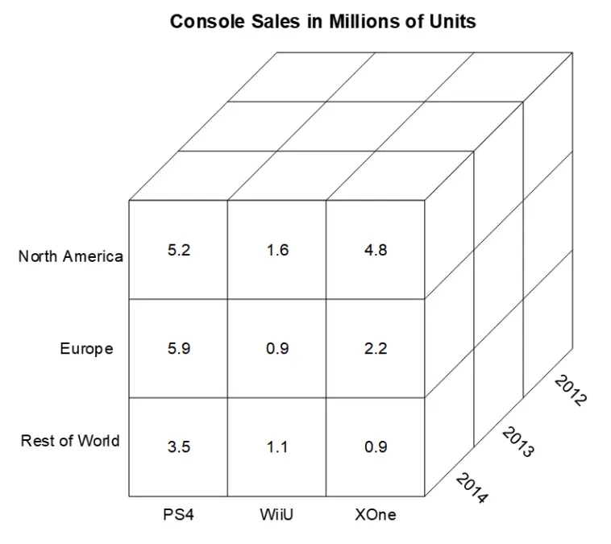
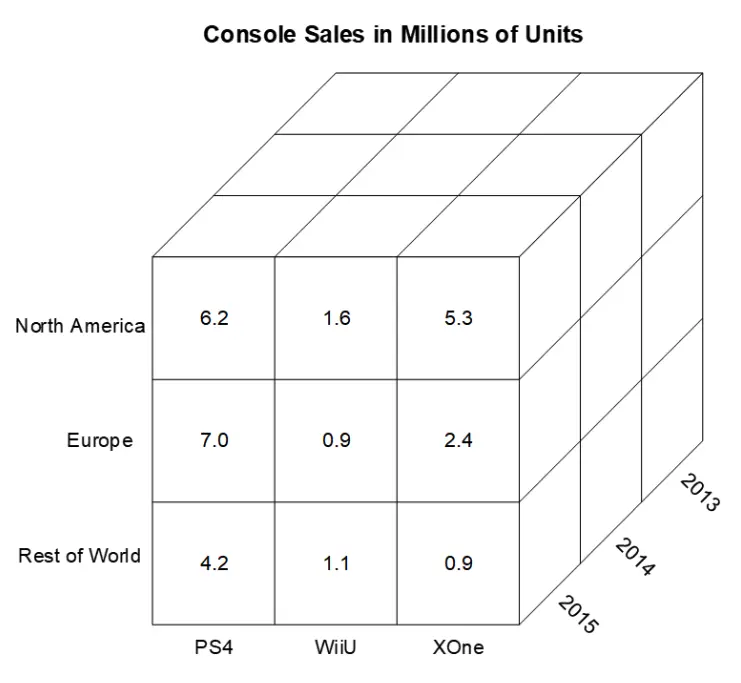
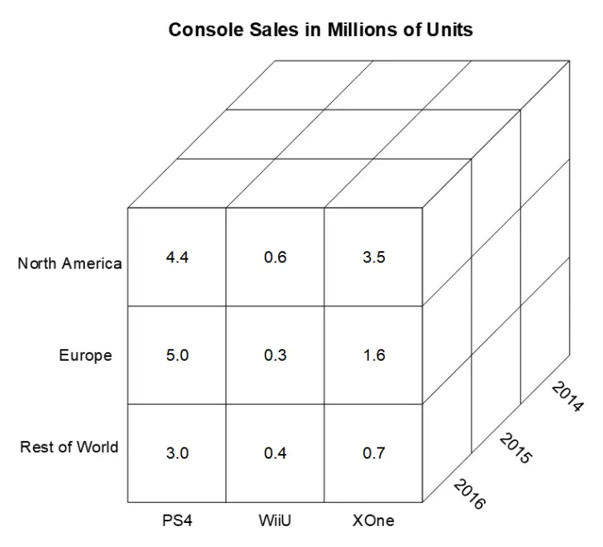
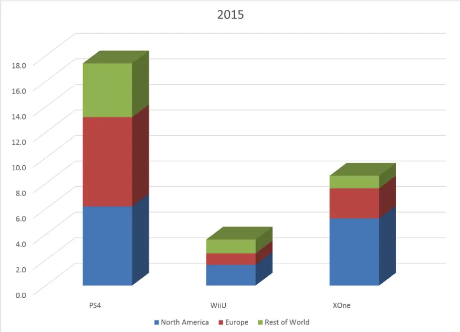
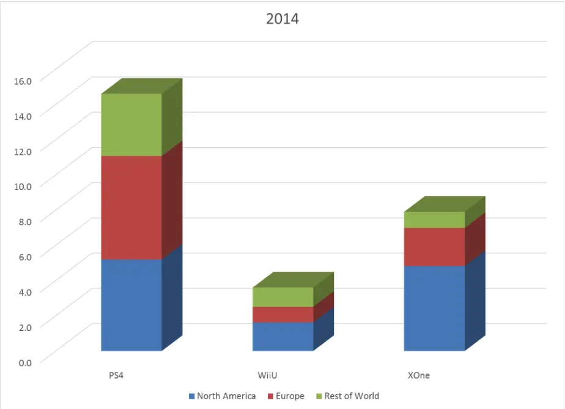
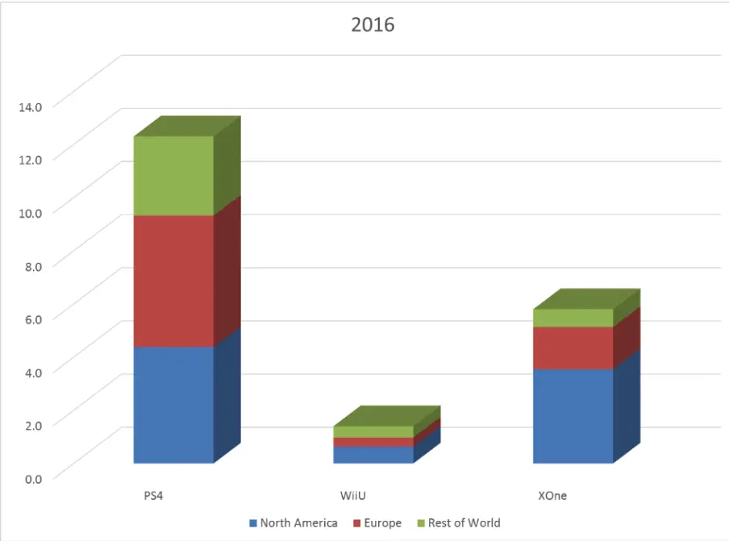

# Normalization - Part 2

## An Un-Normalized Table

| STU_NO | FEE     | PAID | AMOUNT |
| ------ | ------- | ---- | ------ |
| 302910 | Co-op   | Y    | 400.00 |
|        | Parking | N    | 150.00 |
|        | Site    | Y    | 100.00 |
| 319825 | Parking | Y    | 150.00 |
|        | Site    | Y    | 100.00 |
| 327447 | Site    | Y    | 100.00 |
| 349223 | Parking | Y    | 150.00 |
|        | Site    | N    | 100.00 |

- What would you do to put the table in 1NF? **Populate STU_NO**

## A 1NF Table

| STU_NO | FEE     | PAID | AMOUNT |
| ------ | ------- | ---- | ------ |
| 302910 | Co-op   | Y    | 400.00 |
| 302910 | Parking | N    | 150.00 |
| 302910 | Site    | Y    | 100.00 |
| 319825 | Parking | Y    | 150.00 |
| 319825 | Site    | Y    | 100.00 |
| 327447 | Site    | Y    | 100.00 |
| 349223 | Parking | Y    | 150.00 |
| 349223 | Site    | N    | 100.00 |

- What would you do to put the table in 1NF? **Populate STU_NO**
- What is the key for the table when it is in 1NF? **STU_N0 + FEE**

## Three Basic Requirements Of 1NF Table

- Cells must be single valued
- All values in a column must have the same domain
- Each row must be unique

## 1NF Anomalies

- If the information on STU_NO 302910 is dropped, a deletion anomaly arises.
  What does this mean? **Information is lost - Amount for Co-op**
- What other anomalies exist? **Insertion, Update**

## Second Normal Form

- A relation is in second normal form if all of its non-key attributes are
  dependent on all of the key
- Normalize this 1NF table to 2NF.
- What would it look like?
  - **STU_NO + FEE PAID**
  - **FEE AMOUNT**

## Third Normal Form

- A relation is in 3NF if it is in 2NF and has no transitive dependencies

| STU_NO | PROGRAM                | TUITION   |
| ------ | ---------------------- | --------- |
| 349207 | Business               | $1,800.00 |
| 350194 | Computer Systems Tech. | $2,200.00 |
| 352896 | Nursing                | $2,000.00 |
| 357104 | Business               | $1,800.00 |

- Verify that this table is in 1NF and 2NF.
- What is the key for the table?
- Where is the transitive dependency?
- A deletion anomaly occurs when the second row is removed. What does this mean?
  - **Normalize the table into two 3NF tables.**

## 2NF to 3NF

| PROGRAM                | TUITION   |
| ---------------------- | --------- |
| Business               | $1,800.00 |
| Computer Systems Tech. | $2,200.00 |
| Nursing                | $2,000.00 |

| STU_NO | PROGRAM                |
| ------ | ---------------------- |
| 349207 | Business               |
| 350194 | Computer Systems Tech. |
| 352896 | Nursing                |
| 357104 | Business               |

## Normalization Case Study Revisited

- Pipes N Things Inc.
  - A distributor of plumbing parts and fixtures
  - Purchase from manufacturers
  - Supply retailers
  - Designing corporate data base

## Purchasing Department

- Determine vital entities
- Purchase Order document is critical
- This purchase order has a line number, which is simply a count of the number
  of items that appear on each particular purchase order
  - Some times this is known as a sequence number

## OLTP

- All examples considered thus far have been geared to Online Transaction
  Processing (OLTP)
- Most common
- Normalization rules promote unique (non redundant) data

## Normalized Data

- Due to all of the joining required to return meaningful results, normalized
  data is complex to work with
- Derived columns cannot be indexed, therefore normalized data can be slow to
  work with
- For the sake of data integrity, in OLTP scenarios, these are tradeoffs we are
  willing to accept

## OLAP

- OLTP is not the only use for data
- Why would data be collected, if it was’t going to be analyzed too?
- Online Analytical Processing (OLAP) is one of the other significant database
  uses
- Business Intelligence (BI) tools work with OLAP data to provide end users with
  the ability to analyze and report on the data in whatever way makes sense to
  the particular business
- OLAP emphasizes speed and simplicity of access over data integrity
- In fact, OLAP databases are explicitly de-normalized for this purpose
- Data is also pre-summarized according to expected queries
- Also known as Big Data or a Data Warehouse
- OLAP databases are typically fed from OLTP databases on a schedule that
  reflects the complexity of the cube and the volatility of the data
- Daily, Weekly, Monthly
- Therefore OLAP cubes are not usually real time data
- Since analysis is often concerned with trending, this is usually not a concern

## OLAP Cube

- Data in an OLAP database is often conceptualized around the concept of a cube,
  where one of the dimensions is time
- OLAP data is operated on by slicing, dicing, drilling down, etc.

## OLAP Cube Slices

 

 

## Data Warehouse

- Offloading data from the OLTP to the OLAP database allows each database to be
  optimized for its particular task
- This separation ensures that complex, heavy inquiries into the OLAP database
  don’t cause slow downs in the **production** database

## Summary

- Normalizing data to 3NF is almost always adequate for “real world” processing
- OLAP de-normalizes and summarizes data for quick and easy analysis
