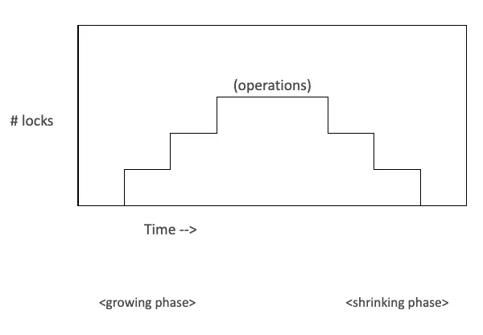

# Concurrency Control

- Transactions
- Locks
- Concurrent processing

## Scenario

- You’re about to buy a new hoodie at the Campus Store with your ONE card
- Here is what three records in the database might look like before you make
  your purchase at the check out counter
- How many database operations are involved in this case?

| student_id | name  |
| ---------- | ----- |
| balance    | 12345 |
| Stu Dent   | 95.00 |

| prod_code  | Item         |
| ---------- | ------------ |
| unit_price | on_hand      |
| H1200      | Black Hoodie |
| 40.00      | 9            |

| account_no | description |
| ---------- | ----------- |
| balance    | 101         |
| Cash       | 750.00      |

## SQL For Scenario (Simplified)

```sql
UPDATE one_card
SET balance = balance – 40
WHERE student_id = 12345;

UPDATE inventory
SET on_hand = on_hand – 1
WHERE prod_code = 'H1200';

UPDATE account
SET balance = balance + 40
WHERE account_no = 101;
```

## SQL For Scenario (Realistic)

```sql
CREATE PROCEDURE purchase
    @student_id INT,
    @qty INT,
    @prod_code VARCHAR(25),
    @return_code INT = 0 OUTPUT -- Assume transaction doesn’t succeed
AS
    DECLARE @available MONEY;
    DECLARE @extended_price MONEY;
BEGIN
    SET @available = (
        SELECT balance
        FROM one_card
        WHERE student_id = @student_id
    );
    SET @extended_price = @qty * (
        SELECT unit_price
        FROM inventory
        WHERE prod_code = @prod_code
    );
    IF @available >= @extended_price
    BEGIN
        UPDATE one_card
        SET balance = balance – @extended_price
        WHERE student_id = @student_id;

        UPDATE inventory
        SET on_hand = on_hand – @qty
        WHERE prod_code = @prod_code;

        UPDATE account
        SET balance = balance + @extended_price
        -- This value likely wouldn’t be hardcoded,
        -- but looked up from some other table.
        WHERE account_no = 101;
        SET @return_code = 1;
    END
END
```

## Scenario

- After the transaction, the rows will look like this

| student_id | name  |
| ---------- | ----- |
| balance    | 12345 |
| Stu Dent   | 55.00 |

| prod_code  | item         |
| ---------- | ------------ |
| unit_price | on_hand      |
| H1200      | Black Hoodie |
| 40.00      | 8            |

| account_no | description |
| ---------- | ----------- |
| balance    | 101         |
| Cash       | 790.00      |

## Transactions

- Definition: A logical unit of work that must be completed in its entirety or
  be aborted
- A transaction is created every time you read from and/or write to a database
- Many transactions consist of two or more database requests
- A transaction that changes the contents of the database must alter the
  database from one consistent state to another
- A consistent database state is one in which all integrity constraints are
  satisfied

## Transaction Properties

- All transactions must adhere to the ACID rules
  - Atomicity
  - Consistency
  - Isolation
  - Durability

## Atomicity

- Either the effects of all or none of its operations remain when a transaction
  is completed (committed or aborted respectively)
- In other words, to the outside world a committed transaction appears to be
  indivisible, atomic
- A transaction is a unit of work that appears as if it is either performed in
  its entirety, or not performed at all ("all or nothing" semantics)
- How does this property apply to our scenario?
- One Card, Inventory and Account must be successfully updated, otherwise
  changes are not made

## Consistency

- Every transaction must leave the database in a consistent state, i.e.,
  maintain the predetermined integrity rules of the database
- All constraints (Entity, Domain and Referential Integrity) must be satisfied
  with each update
- A transaction must transform a database from one consistent state to another
  consistent state

## Isolation

- Transactions cannot interfere with each other
- The effects of an incomplete transaction are not visible to another
  transaction
- A lock guarantees exclusive use of a data item to a current transaction
- Providing isolation is the main goal of concurrency control

## Durability

- Effects of successful (committed) transactions must persist through crashes or
  system failure
- Typically by recording the transaction's effects and its commit event in a
  non-volatile memory (disk)

## Transaction Management

- ANSI standard to govern database transactions supported by SQL commands BEGIN
  TRANSACTION, COMMIT and ROLLBACK
- BEGIN TRANSACTION starts the transaction
- COMMIT completes the transaction
- ROLLBACK aborts all changes, returning the database to its previous consistent
  state
- Transaction logs are used to keep track of all transactions that update the
  database in case of ROLLBACK, a bend or system failure

## ROLLBACK

```sql
SELECT * FROM physicians WHERE physician_id = 2;
SELECT * FROM patients WHERE patient_id = 1251;

BEGIN TRANSACTION;

UPDATE physicians SET specialty = 'Hematology' WHERE physician_id = 2;
UPDATE patients SET allergies = 'Almonds' WHERE patient_id = 1251;

SELECT * FROM physicians WHERE physician_id = 2;
SELECT * FROM patients WHERE patient_id = 1251;

ROLLBACK TRANSACTION;

SELECT * FROM physicians WHERE physician_id = 2;
SELECT * FROM patients WHERE patient_id = 1251;
```

## COMMIT

```sql
SELECT * FROM physicians WHERE physician_id = 2;
SELECT * FROM patients WHERE patient_id = 1251;

BEGIN TRANSACTION T1; -- Optional transaction name

UPDATE physicians SET specialty = 'Hematology' WHERE physician_id = 2;
UPDATE patients SET allergies = 'Almonds' WHERE patient_id = 1251;

SELECT * FROM physicians WHERE physician_id = 2;
SELECT * FROM patients WHERE patient_id = 1251;

COMMIT TRANSACTION T1;

SELECT * FROM physicians WHERE physician_id = 2;
SELECT * FROM patients WHERE patient_id = 1251;
```

## Concurrent Processing

- The co-ordination of simultaneous execution of transactions in a
  multi-processing database system
- To ensure serialize-ability of transactions
  - Execution of transactions in the correct sequence

## Concurrency Control

- Need to avoid data integrity and consistency problems
  - Lost update
    - one record simultaneously updated by two different users
  - Uncommitted data
    - Two concurrent transactions, the first is rolled back after the second has
      accessed the uncommitted data, violating isolation property
  - Inconsistent retrievals
    - One transaction is executing calculations on a set of data while a second
      transaction is updating the same data

## Locks

- Guarantee exclusive use of a data item to a current transaction
- Released when transaction is committed
- Managed by a lock manager
- Lock levels:
  - Database
  - Table
  - Page
  - Row
  - Field

## Two Phase Locking Protocol (2PL)

- Defines how transactions acquire and release locks
- Guarantees serialize-ability
- Does not prevent deadlocks
- Two phases
  - Growing phase: a transaction acquires all required locks, without unlocking
    any data, until lock point
  - Shrinking phase: a transaction releases all locks and cannot obtain any new
    lock



## 2PL Protocol

- Rules
  - Two transactions cannot have conflicting locks
  - No unlock operation can precede a lock operation in the same transaction
  - No data are affected until all locks have been obtained

## Lock Modes

- Shared lock
  - One user asks to read a record
  - Other users may read it
  - No user can update it
- Update lock
  - Temporary state before Exclusive lock
- Exclusive lock
  - One user asks to modify a record
  - No other user can read it or modify it
- Which SQL statement results in a shared lock?
- Why bother locking a record being read?
- Why is an exclusive lock necessary?
- Why prevent users from reading the record?

## Deadlock

- Occurs when two transactions wait for each other to unlock data
  - T1 obtains a lock on X
  - T2 obtains a lock on Y
  - T1 requests a lock on Y
  - T2 requests a lock on X
- Only exists with exclusive locks

## Deadlock Control

- Prevention
  - Transaction is aborted and rescheduled if possibility of deadlock exists
- Detection
  - If a deadlock is found, one transaction is aborted (rolled back) and
    rescheduled while the other continues
- Avoidance
  - Obtain all locks, in succession, before executing
  - increase action response times
- Recommendations:
  - Low probability: detection
  - High probability: prevention
  - Use avoidance where response time is a low priority

## Database Recovery Management

- The database failing for unexpected reasons occurs occasionally
- Possible causes are power or hardware failure
- Recovery restores the database from a given state, usually inconsistent, to a
  previously consistent state
- Techniques used based on atomic transaction property

## Recovery in SQL Server

- As each modification to the database, it goes to the transaction log first, it
  will be written to the database at a later time
- Log records for data modifications record either the logical operation
  performed or they record the before and after images of the modified data
- The before image is a copy of the data before the operation is performed; the
  after image is a copy of the data after the operation has been performed
- In the event of a crash, the Database Administrator restores the database from
  the latest backup and then applies the transaction log
