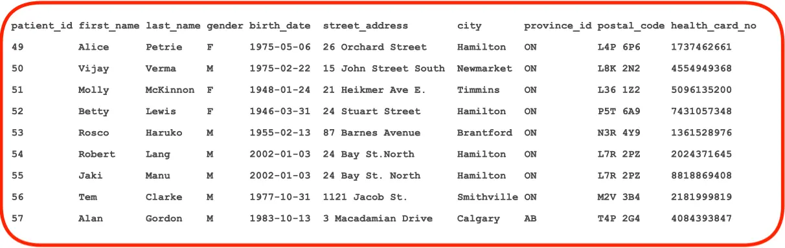
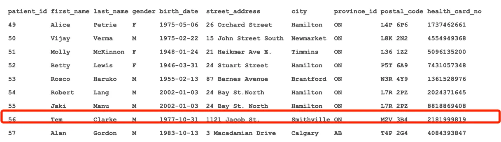
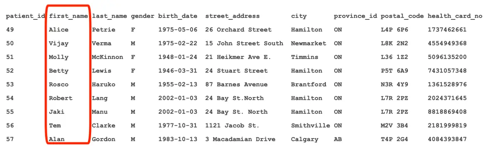
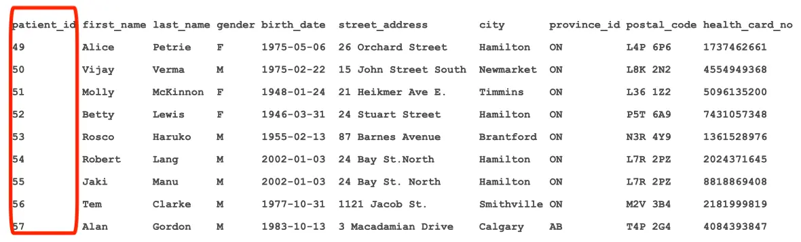
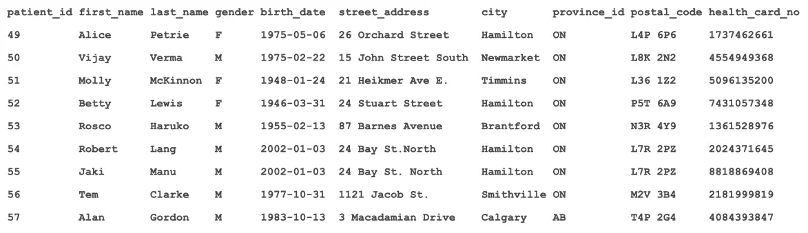
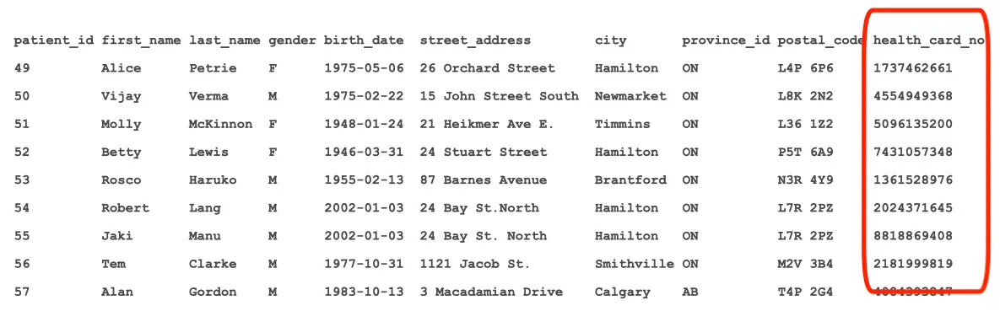
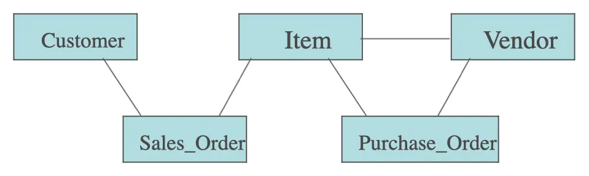

# Database Terminology, Data Dictionary, Creating Tables

## Relation

- A table with rows and columns
- Each row contains information on an instance of an entity



## Tuple

- A row of data



## Attribute

- A column in a table



## Primary Key

- An attribute which uniquely identifies each row



## Determinant

- An attribute whose value determines the value for another attribute
- Usually the primary key



## Functional Dependency

- Relationship between a determinant `A` and dependent attribute `B`
- Represented by A -> B

## Candidate Key

- One of the attributes that could be used as a primary key



## Primary Key

- A good choice for primary keys is a Meaningless But Unique Number (MBUN)
- Start at 1 and keep incrementing
- The int datatype provides 2,147,483,647 possible values
- The bigint datatype provides 9,223,372,036,854,775,807 possible values (> 9
  quintillion)
- Another possible choice is the Globally Unique Identifier (GUID)
- Also known as Universally Unique Identifier (UUID)
- 128 bit integer, typically expressed as 32 hex digits in the pattern
  `8-4-4-4-12`
- Example: `678e6b75-29ad-4cba-8d78-5ad68aad414b`
- Good for decentralized systems
- Likely unique forever

## IDENTITY Property

- SQL Server provides an optional identity property to simplify creating MBUNs
- The identity property would be added to the definition of the primary key
  column when a table is being created
- IDENTITY [ (seed , increment) ]
- Seed and increment are optional, both default to 1
- Using an identity property simplifies INSERTs
- Without an identity property, the primary key must first be determined and
  then specified
- With an identity property, the primary key is left off the INSERT statement
  and the database automatically keeps track of it and provides it when
  necessary

## More Terms…

- Atomic attribute
  - A component of the record definition that is used to describe an entity
  - A field
  - Unique meaningful names
  - Example: postal_code
- Composite attribute
  - Composed of atomic attributes, each defined in the data dictionary
  - Address is comprised of
  - street_address
  - city
  - province_id
  - postal_code
- Derived attribute
  - An attribute whose value is obtained by applying a formula to other data
    elements
  - Examples:
    - `sales commission = sales * percentage`
    - `age = DATEDIFF(YEAR, birth_date, GETDATE())`
- Multi-valued attribute
  - An attribute with multiple possible values
  - A employee can have more than one skill
- Alias
  - Synonym
  - A different name for a data element with the same meaning
  - `SELECT COUNT(*) AS total FROM patients`
- Domain
  - The set of possible values an attribute can take on
- Concatenated Key
  - Also known as Composite Key, Compound Key
  - Two or more attributes taken together to uniquely identify a record
  - Examples:
    - patient_id, admission_date in admissions table
    - purchase_order_id, line_num in purchase_order_lines table
- Secondary Key
  - Requires an index may not be unique
  - Example: last_name
- Sort Key
  - Used to physically sequence a file
  - Example: seniority listing of employee records
- Foreign Key
  - A field (or multiple fields) in a table that uniquely identifies a row of
    another table (or the same table)
    - Example: nursing_unit_id in admissions table
- Entity Occurrence
  - Represented by a record with actual data values in it, or a row in a table
- Schema
  - The definition of an entire database
  - In SQL Server, schemas are used as containers to organize database objects

## Models and Database Design

- The process of database design is an evolutionary one in which we move through
  different stages. At each stage a particular model is constructed
- Stage 1: Develop the Conceptual Model
- Stage 2: Convert the Conceptual Model to an Internal Model
- Stage 3: Map the Internal Model to a Physical Model

## Stage 1: Develop Conceptual Model

- In this model we describe each entity completely (i.e. identify all its
  attributes)
- For each entity we identify the key attribute and the dependent attributes
- Between pairs of entities we identify relationships

## Stage 2: Convert Conceptual to Internal Model

- Here we set up an internal model that is compatible with the DBMS we have
  selected
- The internal model is also known as a schema
- In the internal model, the relationships between entities fit the structure of
  a hierarchy or a network or exist as relations between tables
- The internal model is required to satisfy each user view (external model)

## Database History

- Before databases, there was the flat file
  - Data redundancy (the same data in two or more files)
  - Program-data dependency
  - Lack of reliability
  - Lack of access flexibility
  - Lack of security
  - Lack of data integrity

## Database History – 1960s

- Hierarchical database model was introduced
  - A database that has parent files and children files
  - Cannot be changed structurally
  - Navigation is not easy
- Network database model followed
  - Navigation more efficient than hierarchical model
  - Cannot be changed structurally
  - Extremely complicated

## Hierarchical and Network

- Both Hierarchical and Network models require all relationships to be
  predefined prior to implementing database
- To modify the database, the database must be completely re-created and the
  data copied to the new DB

## Relational Model

- Relational model developed at IBM by Edgar Codd in 1970
- Data is represented as two-dimensional tables or relations
- Oracle released first RDBMS in 1979
- Far more flexible than Hierarchical or Network
- New relationships can be created at any time
- Data model may be altered at any time
- [Dominant database model in IT](http://db-engines.com/en/ranking)



## Stage 3: Map the Internal Model to a Physical Model

- The physical model specifies
  - On what devices the data is stored
  - How the data is stored
  - What indexing techniques are used for direct access to records
  - What file organizations are used

## The System Catalog

- Definition
  - A detailed system data dictionary that describes all objects in the database

## The System Catalog AKA

- Metadata
- Data dictionary
- System Tables (SQL Server)
- System dictionary

## System Tables

- Starting with SQL Server 2005, all System Tables are hidden and inaccessible
  directly
- A large collection of System Views have been created to accommodate accessing
  of database’s metadata
- Two schemas
  - INFORMATION_SCHEMA
  - sys

## Views in INFORMATION_SCHEMA

| ---                     | ---                    |
| ----------------------- | ---------------------- |
| CHECK_CONSTRAINTS       | COLUMN_DOMAIN_USAGE    |
| COLUMN_PRIVILEGES       | COLUMNS                |
| CONSTRAINT_COLUMN_USAGE | CONSTRAINT_TABLE_USAGE |
| DOMAIN_CONSTRAINTS      | DOMAINS                |
| KEY_COLUMN_USAGE        | PARAMETERS             |
| REFERENTIAL_CONSTRAINTS | ROUTINE_COLUMNS        |
| ROUTINES                | SCHEMATA               |
| TABLE_CONSTRAINTS       | TABLE_PRIVILEGES       |
| TABLES                  | VIEW_COLUMN_USAGE      |
| VIEW_TABLE_USAGE        | VIEWS                  |

## sys Schema

- The sys schema is more exhaustive than INFORMATION_SCHEMA
- However, it is more complex and not as nice to work with for many tasks

## Creating Tables

```sql
CREATE TABLE TableName (
    ColumnName1 DataType[(size)] [NOT NULL] [DEFAULT value],
    ColumnName2 DataType[(size)] [NOT NULL] [DEFAULT value],
    [
        CONSTRAINT CK_ConstraintName
        CHECK (ConstraintCheckCondition)
    ]
    CONSTRAINT PK_ConstraintName
    PRIMARY KEY(
        ColumnName
        [ColumnName]
        [
            CONSTRAINT FK_ConstraintName
            FOREIGN KEY (ColumnName)
            REFERENCES TableName (ColumnName)
            ON DELETE RESTRICT
            ON UPDATE RESTRICT
        ]
)
```

- When creating tables, constraints (primary key, check, foreign key) can be
  specified inline or at the end of the statement
- Or tables can be created interactively by right clicking on Tables and
  selecting Table…
- Fill in the data from there

## Table Creation Example

```sql
CREATE TABLE Employees(
    employee_id     INT NOT NULL,
    employee_name   VARCHAR(50) NOT NULL,
    department_id   INT,
    job_id          CHAR(3),
    birth_date      DATE,
    gender          CHAR(1),
    salary          DECIMAL(8, 2),
    CONSTRAINT PK_employees PRIMARY KEY(employee_id),
    CONSTRAINT CK_gender CHECK(gender IN ('M', 'F')),
    CONSTRAINT CK_salary CHECK(salary >= 0),
    CONSTRAINT FK_employees_department_id_departments
    FOREIGN KEY(department_id)
    REFERENCES departments(department_id)
)
```

## Table Creation Example with IDENTITY and Constraints Specified Inline

```sql
CREATE TABLE employees_with_identity(
    employee_id   INT IDENTITY PRIMARY KEY,
    employee_name VARCHAR(50) NOT NULL,
    department_id INT FOREIGN KEY REFERENCES departments(department_id),
    job_id        CHAR(3),
    birth_date    DATE,
    gender        CHAR(1) CHECK(gender IN ('M', 'F')),
    salary        DECIMAL(8, 2) CHECK(salary >= 0)
)
```

## Data Types

- *Commonly used
- **To be deprecated

| Exact Numerics | Approximate Numerics | Date and Time  | Character Strings | Unicode Character Strings | Binary Strings | Other Data Types |
| -------------- | -------------------- | -------------- | ----------------- | ------------------------- | -------------- | ---------------- |
| bigint         | float                | date*          | char              | nchar                     | binary         | Cursor           |
| bit            | real                 | datetime2      | text**            | ntext**                   | image**        | hierarchyid      |
| decimal*       |                      | datetime       | varchar           | nvarchar                  | varbinary      | sql_variant      |
| int*           |                      | datetimeoffset |                   |                           |                | table            |
| money*         |                      | smalldatetime  |                   |                           |                | timestamp        |
| numeric        |                      | time           |                   |                           |                | uniqueidentifier |
| smallint       |                      |                |                   |                           |                | xml              |
| smallmoney     |                      |                |                   |                           |                |                  |
| tinyint        |                      |                |                   |                           |                |                  |

## NULL

- All data types support the concept of NULL
- NULL is the absence of a value, it is unknown
- For a numeric column NULL is not 0
- For a string column NULL is not `''`
