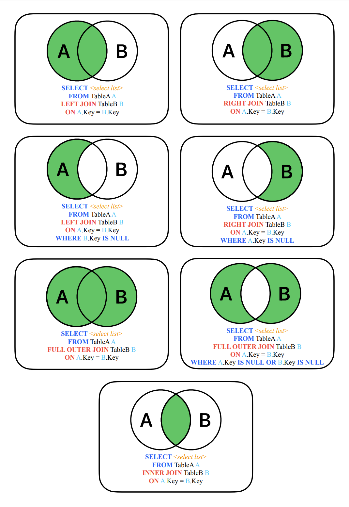

# SQL Join

## Joining Tables

- Frequently it is useful to join the data from multiple tables together

```sql
SELECT column(x)
FROM firsttable
JOIN secondtable
ON firsttable.column = secondtable.column
```

- Example:

```sql
SELECT *
FROM purchase_orders
JOIN purchase_order_lines
ON purchase_orders.purchase_order_id = purchase_order_lines.purchase_order_id
```

- Select all columns from both tables
- Join on purchase order number

## Join Types

- Inner join (default)
- Left outer join
- Right outer join
- Full outer join
- Cross join

## Sample Tables

- Join examples will use these tables

### purchase_lines

| product_id | purchased |
| ---------- | --------- |
| 100        | 15        |
| 102        | 25        |
| 103        | 10        |
| 106        | 10        |

### sales_lines

| product_id | sold |
| ---------- | ---- |
| 100        | 5    |
| 101        | 6    |
| 103        | 8    |
| 104        | 5    |
| 106        | 7    |

## Inner Join

```sql
SELECT s.product_id, sold, purchased
FROM sales_lines s -- s is table alias
INNER JOIN purchase_lines p -- p is table alias
ON s.product_id = p.product_id
```

- Table aliases (e.g. `s` and `p` here) used to simplify typing
- INNER is optional
- If column is not unique, it must be qualified
- Most commonly used join type
- ANSI 92 syntax

## Inner Join Results

- Rows returned only if they exist in both tables

| product_id | sold | purchased |
| ---------- | ---- | --------- |
| 100        | 5    | 15        |
| 103        | 8    | 10        |
| 106        | 7    | 10        |

## Left Outer Join

```sql
SELECT s.product_id, sold, purchased
FROM sales_lines s
LEFT OUTER JOIN purchase_lines p
ON s.product_id = p.product_id
```

- OUTER is optional

## Left Outer Join Results

- All rows returned from left (first) table
- Matching rows returned from right (second) table
- Missing values returned as NULL

| product_id | sold | purchased |
| ---------- | ---- | --------- |
| 100        | 5    | 15        |
| 101        | 6    | NULL      |
| 103        | 8    | 10        |
| 104        | 5    | NULL      |
| 106        | 7    | 10        |

## Right Outer Join

```sql
SELECT s.product_id, sold, purchased
FROM sales_lines s
RIGHT OUTER JOIN purchase_lines p
ON s.product_id = p.product_id
```

- OUTER is optional

## Right Outer Join Results

- All rows returned from right (second) table
- Matching rows returned from left (first) table
- Missing values returned as NULL

| product_id | sold | purchased |
| ---------- | ---- | --------- |
| 100        | 5    | 15        |
| NULL       | NULL | 25        |
| 103        | 8    | 10        |
| 106        | 7    | 10        |

## Right Outer Join

```sql
SELECT p.product_id, sold, purchased
FROM sales_lines s
RIGHT OUTER JOIN purchase_lines p
ON s.product_id = p.product_id
```

| product_id | sold | purchased |
| ---------- | ---- | --------- |
| 100        | 5    | 15        |
| 102        | NULL | 25        |
| 103        | 8    | 10        |
| 106        | 7    | 10        |

## Full Outer Join

```sql
SELECT s.product_id, p.product_id, sold, purchased
FROM sales_lines s
FULL OUTER JOIN purchase_lines p
ON s.product_id = p.product_id
```

- OUTER is optional

## Full Outer Join Results

- All rows returned from both tables
- Missing values returned as NULL

| product_id | product_id | sold | purchased |
| ---------- | ---------- | ---- | --------- |
| 100        | 100        | 5    | 15        |
| 101        | NULL       | 6    | NULL      |
| 103        | 103        | 8    | 10        |
| 104        | NULL       | 5    | NULL      |
| 106        | 106        | 7    | 10        |
| NULL       | 102        | NULL | 25        |

## Cross Join

```sql
SELECT p.product_id, sold, purchased
FROM sales_lines s
CROSS JOIN purchase_lines p
```

## Cross Join Results

- Each row from left table is joined with each row from right table
- Rarely used
- Cross join results are usually an error

| product_id   | sold | purchased |
| ------------ | ---- | --------- |
| 100          | 5    | 15        |
| 100          | 6    | 15        |
| 100          | 8    | 15        |
| 100          | 5    | 15        |
| 100          | 7    | 15        |
| 102          | 5    | 25        |
| 14 more rows |      |           |

## Older Syntax – Inner Join

```sql
SELECT s.product_id, sold, purchased
FROM sales_lines s, purchase_lines p
WHERE s.product_id = p.product_id
```

- Pre ANSI 92 syntax
- Joins were inner
- Cross join if where clause omitted

## Joining 3 Tables

```sql
SELECT first_name, last_name, medication_description, dosage
FROM patients p
JOIN unit_dose_orders u
ON p.patient_id = u.patient_id
JOIN medications m
ON u.medication_id = m.medication_id
ORDER BY last_name, first_name, medication_description
```

## Sample Table (_employees_)

| employee_id | first_name | last_name | department | title | supervisor | salary        |
| ----------- | ---------- | --------- | ---------- | ----- | ---------- | ------------- |
| 101         | Malcolm    |           | Reynolds   |       | Management | President     |
| 102         | Zoe        |           | Washburne  |       | Sales      | VP of Sales   |
| 103         | Jayne      |           | Cobb       |       | Sales      | Sales Rep     |
| 104         | Hoban      |           | Washburne  |       | Finance    | VP of Finance |
| 105         | Kaylee     |           | Frye       |       | Finance    | AP Clerk      |
| 106         | Inara      |           | Serra      |       | Finance    | AR Clerk      |
| 107         | Simon      |           | Tam        |       | Sales      | Sales Rep     |
| 108         | Derrial    |           | Book       |       | Sales      | Sales Rep     |
| 109         | River      |           | Tam        |       | Finance    | GL Clerk      |

## Joining a Table with Itself

```sql
SELECT e1.employee_id, e1.first_name, e1.last_name, e1.department, e1.title, e1.supervisor, e2.employee_id, e2.first_name, e2.last_name
FROM employees e1
JOIN employees e2
ON e1.supervisor = e2.employee_id
ORDER BY e1.department, e1.employee_id
```

- Somebody’s missing

```sql
SELECT e1.employee_id, e1.first_name, e1.last_name, e1.department, e1.title, e1.supervisor, e2.employee_id, e2.first_name, e2.last_name
FROM employees e1
LEFT JOIN employees e2
ON e1.supervisor = e2.employee_id
ORDER BY e1.department, e1.employee_id
```

- That’s everybody

## SQL Joins


