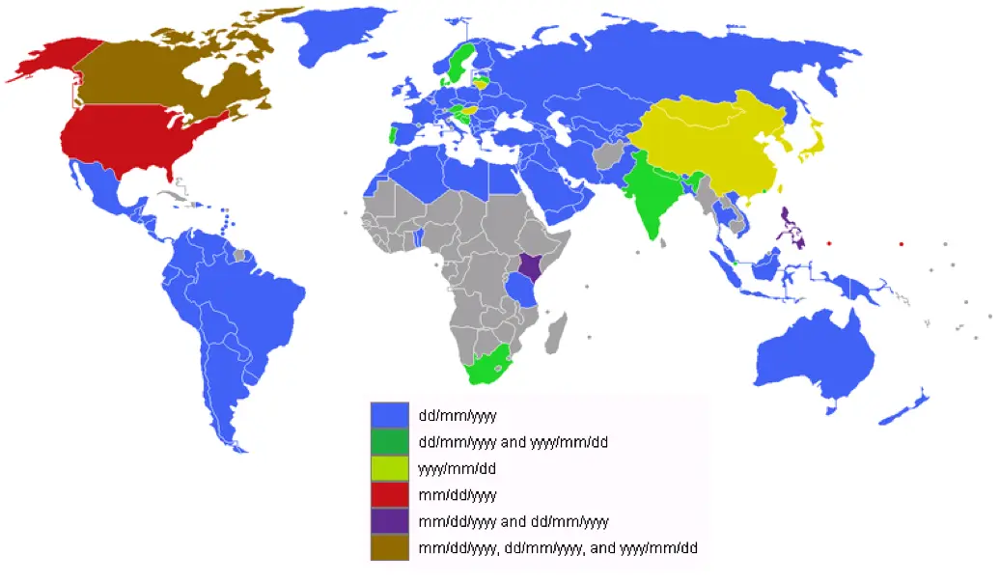

# Date Processing in SQL Server

## Date Processing is Complex

- The Internet Assigned Numbers Authority (IANA) maintains a time zone database
  at: <br> [Time Zones](https://www.iana.org/time-zones)
- It gets revised every year
  - So far, in 2018 it has been revised 5 times
  - In 2017 it was revised 3 times
  - In 2016 it was revised 10 times
  - In 2015 it was revised 7 times

## Date Format

- Consider the following date:
  - 01/02/03
  - Americans would say January 2, 2003
  - British would say February 1, 2003
  - Chinese would say February 3, 2001
  - Canadians wouldn’t be sure
- Consider the following date:
  - 2001-02-03
  - Everybody would say February 3, 2001
  - In Windows, the Regional and Language Options of the host computer control
    date formatting
  - The Government of Canada recommends YYYY-MM-DD which is the ISO 8601
    standard

## Global Date Formats



## SQL Server

- As of SQL Server 2008 the default date format is yyyy-mm-dd
- Previous versions default format was mm/dd/yy or mm/dd/yyyy
- In a SQL script, we can control the date format using the SET DATEFORMAT
  command

## SET DATEFORMAT

- SET DATEFORMAT format
- format can be:
  - dmy (Preferred in much of the world)
  - mdy (Preferred in USA)
  - ymd (Unambiguous, best choice)
  - ydm (Should be avoided)
  - myd (Should be avoided)
  - dym (Should be avoided)

## Date Functions

- Date functions are scalar
- Scalar functions can be used wherever an expression can be used
- An expression can be
  - A column name (most common)
  - Text
  - A function or formula

## DATEDIFF

- DATEDIFF(datepart, startdate, enddate)
- datepart
  - year, quarter, month, dayofyear, day, week, hour, minute, second,
    millisecond, microsecond, nanonsecond

```sql
SELECT DATEDIFF(DAY, '2017-01-01', '2018-09-01') -- 608 days

SELECT DATEDIFF(MONTH, '2017-01-01', '2018-09-01') -- 20 months

SELECT DATEDIFF(YEAR, '2017-01-01', '2018-09-01') -- 1 year

SELECT DATEDIFF(YEAR, '1999-11-15', '2018-10-02') -- 19 years

-- Be careful, DATEDIFF with YEAR does not calculate age
-- A person born on November 15, 1999 is not 19 on October 2, 2018
-- DATEDIFF extracts the YEAR from both dates and performs subtraction without considering the months or days

SELECT FLOOR(DATEDIFF(DAY, '1999-11-15', '2018-10-02') / 365.25) -- 18 years

-- This approach is much better, but not perfect
-- This is as accurate as SQL Server can get short of writing a stored procedure or program code
```

## DATEADD

- DATEADD(datepart, number, date)

```sql
SELECT DATEADD(DAY, 60, '2018-09-01') -- 2018-10-31

SELECT DATEADD(MONTH, 5, '2018-09-01') -- 2019-02-01

SELECT DATEADD(YEAR, 3, '2018-09-01') -- 2021-09-01
```

## Date Subtraction

- There is no DATESUB, use DATEADD with negative values

```sql
SELECT DATEADD(DAY, -60, '2018-09-01') -- 2018-07-03

SELECT DATEADD(MONTH, -5, '2018-09-01') -- 2018-04-01

SELECT DATEADD(YEAR, -3, '2018-09-01') -- 2015-09-01
```

## Current Date

- The GETDATE function returns the current date with time

```sql
SELECT GETDATE()
```

- To get the date without the time, the CONVERT function can be used

```sql
SELECT CONVERT(DATE, GETDATE())
```

- Calculate patient age

```sql
SELECT birth_date, FLOOR(DATEDIFF(DAY, birth_date, GETDATE()) / 365.25)
FROM patients
```

## Extracting Date Parts

- DAY(date) extracts the day of the month
- MONTH(date) extracts the month of the year
- YEAR(date) extracts the year

```sql
SELECT birth_date,
    YEAR(birth_date) AS [year],
    MONTH(birth_date) AS [month],
    DAY(birth_date) AS [day]
FROM patients
```

- DATEPART(datepart, date)

```sql
SELECT encounter_date_time,
    DATEPART(HOUR, encounter_date_time) AS [hour],
    DATEPART(MINUTE, encounter_date_time) AS [minute],
    DATEPART(SECOND, encounter_date_time) AS [second]
FROM encounters
```

- DATENAME(datepart, date) works like DATEPART but returns a string instead of
  an integer

```sql
SELECT encounter_date_time,
    DATENAME(HOUR, encounter_date_time) AS [hour],
    DATENAME(MINUTE, encounter_date_time) AS [minute],
    DATENAME(SECOND, encounter_date_time) AS [second]
FROM encounters
```
