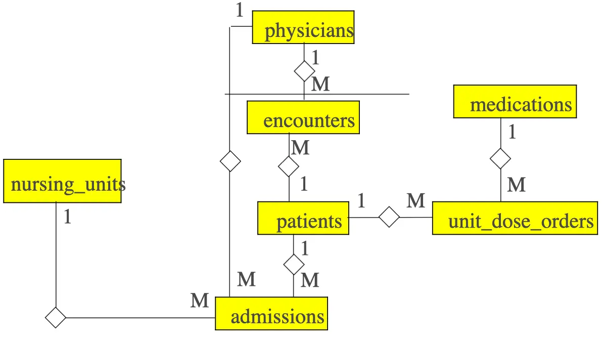

# Entity Relationship Model

## What is it?

- A form of semantic modeling
- A description of the data in a system
- Today’s method influenced by Peter Chen who devised ERM in 1976
- Represented by Entity Relationship Diagrams (ERDs)

## Entities

- A person, a place, a thing or an event about which we keep information
- Shown as a rectangular box, labeled with the name of the entity

## Bank Entities

- People or companies
  - Customers, Tellers, Suppliers
- Places
  - Branches, Regions
- Things
  - Accounts, Fixed assets
- Events
  - Withdrawals, Deposits, Loan Applications

## Bank ERD

## Relationships

- Exists between pairs of entities
- Three kinds
  - One to one 1:1
  - One to many 1:M
  - Many to many M:N

## Employee Time Tickets

## What would the ERDs look like for these related entities?

- Students, Transcripts
- Instructors, Students
- Classes, Students
- Teams, Players
- Patients, Beds

## Library Example

- Entities
  - Members
  - Books
  - Copies
  - BorrowTransactions

## Designing a Database

- Step 1. Identify the Vital Entities
  - Interview representatives
  - Examine existing systems
- Step 2. Define Entities and Relationships
  - Determine the key and dependent attributes

## Step 1. Identify the Vital Entities

- Community Hospital DataBase (CHDB)
  - Patients
  - Doctors
  - Medications
  - Nursing units

## Step 2. Define Entities and Relationships

- CHDB patients
  - Name
  - Phone
  - Address
  - Health Card Number
  - Allergies
  - ??

## Many-to-many Relationships

- Cannot be directly implemented in DBMS
- Use intersection entities

- Patients and Physicians
- Patients and Medications
- Patients and Nursing Units

## Implementable ERD

## ER Modeling Symbols

## CHDB ERD

- Commuity Hospital Database - Entity Relationship Diagrams

