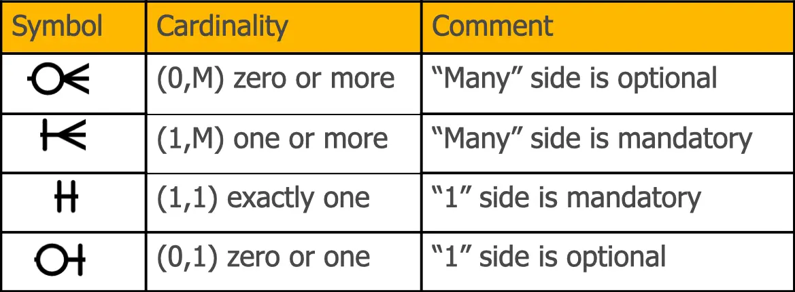
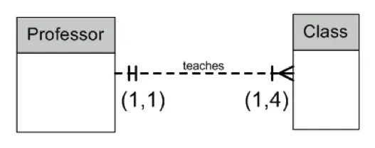
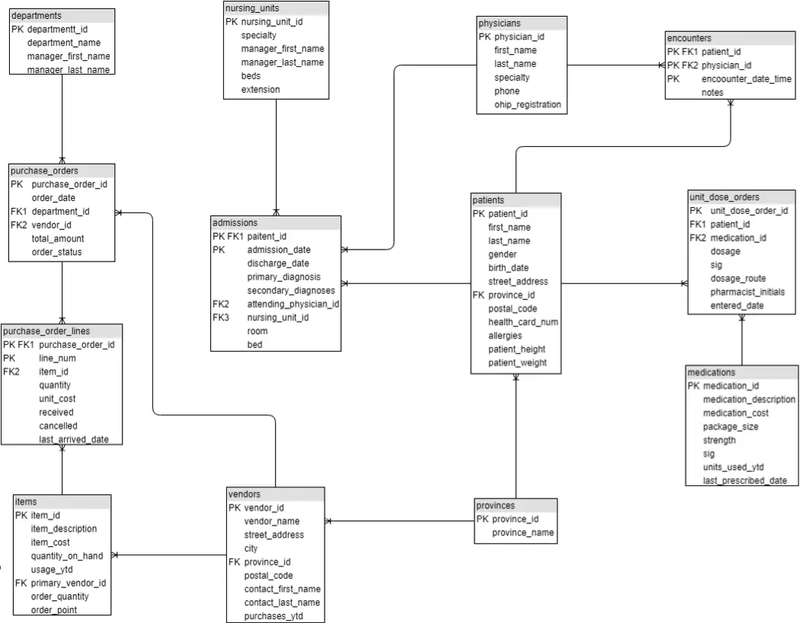
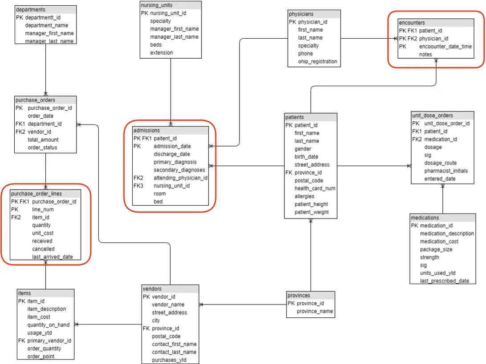
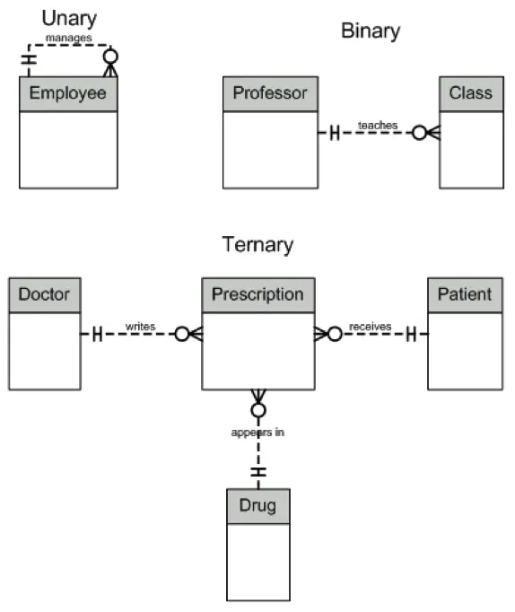

# Relationships, Cardinality, Business Rules

## Relationships

- A relationship is an association between entities
- A nursing unit may have many admitted patients
- Each admitted patient resides in one nursing unit
- This relationship is one to many
- Each department is managed by one employee
- An employee may manage only one department
- This relationship is one to one

## Cardinality

- The number of entity occurrences possible on the two sides of a relationship
- Cardinality leads to an important conclusion, whether a particular entity’s
  participation is mandatory or optional

## Cardinality Range

- Professors teach classes
- However, sometimes there are specific ranges
- A Professor must teach at least one class, but no more than four
- Database doesn’t enforce this, must be done with program logic; this is known
  as a business rule

## Crow’s Foot Symbols



## Cardinality Range Example



- (1,4) means a Professor must teach a minimum of one Class and a maximum of
  four
- (1,1) means that a Class is taught by one and only one Professor

## Weak Entity

- There are two conditions that make an entity weak
- Its existence depends on the existence of another entity (called a parent
  entity)
- It has a concatenated key, one of whose parts is taken from the parent entity

## CHDB ERD


## CHDB ERD - Detailed



## Weak Entities



## Degree

- A unary relationship has one entity
  - Employee supervisor
  - A peer-tutor program at the college
  - Also known as a recursive relationship
- A binary relationship has two entities
- A ternary relationship has three entities
- A four-entity relationship has four entities
- etc.
- Ternary (and higher) relationships are usually represented by a series of
  binary relationships

## Relationship Examples



## Examples of Business Rules

- An employee id must be unique
- A customer province must be valid
- Account status can be active or inactive
- A machine operator may not work more than 10 hours in any 24 hour period
- Reorder items when inventory falls below 5

## What are Business Rules?

- Specifications that preserve the integrity of a conceptual or logical data
  model
- Stored as part of the database
- Help standardize the company’s view of data
- Four types

## 4 Types of Business Rules

- Entity integrity
- Referential integrity
- Domains
- Triggering operations

## Entity Integrity

- Each instance of an entity must have a unique identifier that is not null
- The primary key

## Referential Integrity

- Rules governing the relationships between entities
- Refer to the foreign keys which link tables
- Can’t insert a purchase order for a non-existent department

```sql
INSERT INTO purchase_orders (purchase_order_id, order_date, department_id, vendor_id, total_amount, order_status)
VALUES (60, GETDATE(), 11, 5, 0, 'ACTIVE')
```

- Can’t delete a province that is used in patient or vendor records

```sql
DELETE provinces
WHERE province_id = 'SK'
```

## Domains

- Associated with constraints that restrict the values permitted in a column
- Advantages
  - Verify values for an attribute (during INSERT or UPDATE operations)
  - Ensure data manipulation operations (joins, unions) are logical
- Example: patient_height > 0

## Triggering Operations

- Rules that are invoked on the action of data manipulation operations (INSERT,
  UPDATE, DELETE)
- Uses
  - Automatically generate derived column values
  - Prevent invalid transactions
  - Enforce complex security authorizations
  - Provide transparent event logging/auditing
  - Used as a last resort

## Triggers as a Last Resort

- When a required referential integrity rule cannot be enforced using the
  following integrity constraints:
  - NOT NULL
  - UNIQUE key
  - PRIMARY KEY
  - FOREIGN KEY
    - NO ACTION (delete and update)
    - RESTRICT (delete and update)
    - CASCADE (delete)
    - SET NULL (delete)
    - SET DEFAULT (delete)
  - CHECK
- To enforce referential integrity when child and parent tables are on different
  nodes of a distributed database
- To enforce complex business rules not definable using integrity constraints

## How would these business rules be implemented?

- An employee id must be unique (**Entity integrity**)
- A customer province must be valid (**Referential integrity**)
- Account status can be active or inactive (**Domain**)
- A machine operator may not work more than 10 hours in any 24 hour period
  (**Trigger**)
- Reorder items when inventory falls below 5 (**Trigger**)
